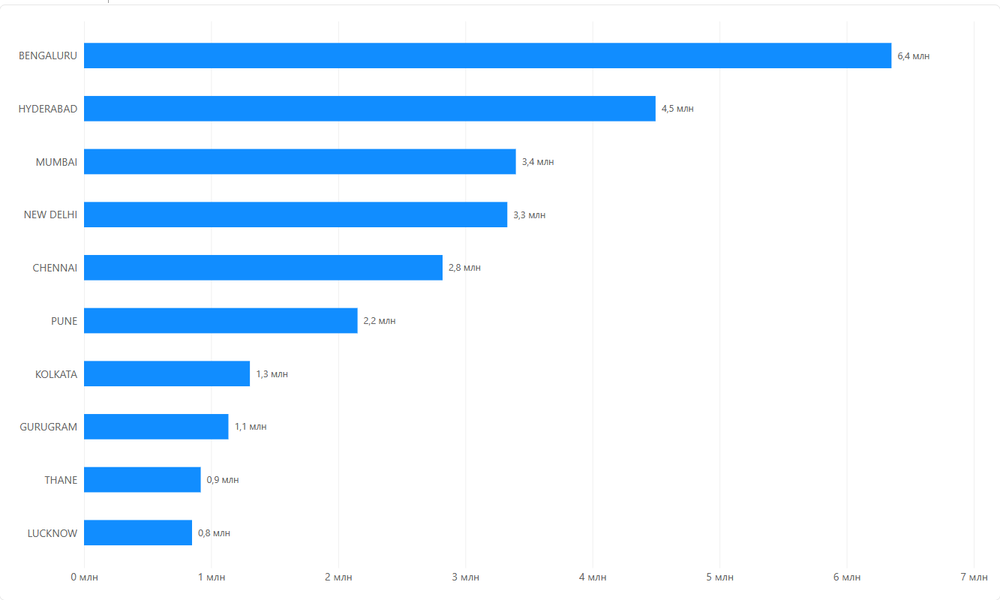

Комплексный анализ продаж маркетплейса Amazon (SQL + Python)

1. Описание проекта
Данный пет-проект посвящен сквозному анализу исторических данных о продажах крупного e-commerce ритейлера (подразделение Amazon в Индии). На основе сырого датасета объемом более 100 000 строк была спроектирована локальная база данных, написаны аналитические SQL-запросы для извлечения бизнес-метрик и построена визуализация ключевых трендов.
Цель исследования: Выявить ключевые драйверы выручки, оценить масштаб финансовых потерь от отмен заказов, сегментировать аудиторию и определить приоритетные регионы для оптимизации логистических цепочек.

2. Стек технологий и инструменты
СУБД и язык запросов: SQLite (диалект ANSI SQL)
Язык обработки данных: Python (Pandas) — для ETL-процесса (загрузка сырых CSV в реляционную БД)
Среда разработки: Jupyter Notebook
Визуализация: Matplotlib

3. Архитектура данных и предобработка
Сырые данные были импортированы в таблицу `amazon_sales`. В процессе работы были обработаны следующие технические нюансы:
- Исправлены конфликты синтаксиса SQL при обращении к столбцам со спецсимволами (`"ship-city"`, `"Order ID"`).
- Текстовый формат дат `MM-DD-YY` был денормализован и преобразован к международному стандарту `YYYY-MM-DD` с помощью строковых функций `SUBSTR` для корректной хронологической сортировки.

3. Ключевые этапы анализа и SQL-запросы
3.1. Товарная аналитика: ТОП-5 категорий по выручке
Запрос определяет структуру продаж, отсекая транзакции со статусом `Cancelled` (Отменено), чтобы не искажать реальную прибыль.
```sql
SELECT 
    Category AS "Категория",
    SUM(Amount) AS "Общая выручка",
    COUNT("Order ID") AS "Количество заказов",
    ROUND(AVG(Amount), 2) AS "Средний чек"
FROM amazon_sales
WHERE Status NOT LIKE '%Cancelled%'
GROUP BY Category
ORDER BY "Общая выручка" DESC
LIMIT 5;
```

3.2. Финансовый аудит: Упущенная выручка из-за отмен
Анализ «болевых точек» бизнеса — расчет объема замороженных и потерянных средств из-за отмены заказов клиентами или маркетплейсом.
```sql
SELECT 
    Category AS "Категория",
    COUNT("Order ID") AS "Количество отмен",
    ROUND(SUM(Amount), 2) AS "Упущенная выручка"
FROM amazon_sales
WHERE Status LIKE '%Cancelled%'
GROUP BY Category
ORDER BY "Упущенная выручка" DESC;
```

3.3. Юнит-экономика и сегментация: B2B vs B2C
Сравнение поведения обычных розничных покупателей и коммерческих организаций (флаг `B2B`).
```sql
SELECT 
    CASE WHEN B2B = 1 THEN 'Бизнес (B2B)' ELSE 'Розница (B2C)' END AS "Тип клиента",
    COUNT("Order ID") AS "Всего заказов",
    ROUND(SUM(Amount), 2) AS "Общая сумма покупок",
    ROUND(AVG(Amount), 2) AS "Средний чек"
FROM amazon_sales
WHERE Status NOT LIKE '%Cancelled%'
GROUP BY B2B;
```

3.4. Анализ временных рядов: Динамика продаж по дням
Выявление сезонности спроса и аномальных пиков продаж с предварительной конвертацией типов данных.
```sql
SELECT 
    '20' || SUBSTR(Date, 7, 2) || '-' || SUBSTR(Date, 1, 2) || '-' || SUBSTR(Date, 4, 2) AS "Дата",
    ROUND(SUM(Amount), 2) AS "Выручка за день"
FROM amazon_sales
WHERE Status NOT LIKE '%Cancelled%' AND Date IS NOT NULL
GROUP BY "Дата"
ORDER BY "Дата" ASC;
```

3.5. Географический анализ: ТОП-10 городов-потребителей
Поиск ключевых локаций для понимания географии распределения клиентов.
```sql
SELECT 
    "ship-city" AS "Город",
    SUM(Amount) AS "Выручка"
FROM amazon_sales
WHERE Status NOT LIKE '%Cancelled%' AND "ship-city" IS NOT NULL
GROUP BY "ship-city"
ORDER BY "Выручка" DESC
LIMIT 10;
```

4. Главные выводы
Драйверы роста: Основную долю выручки генерируют категории, попавшие в топ (например, `Set` и `kurta`), что говорит о фокусе потребителей на определенном типе традиционной или повседневной одежды.
Проблема отмен: Высокий уровень упущенной выручки сигнализирует о необходимости оптимизации работы с отказами (возможно, стоит улучшить описание товаров или проверить качество работы службы доставки `Easy Ship`).
Потенциал B2B: Несмотря на то, что B2B-клиенты составляют меньшую долю от общего объема заказов, их средний чек значительно выше розничного, что делает этот сегмент приоритетным для маркетинга.
Географическое доминирование: График топ-10 городов показывает, что выручка сильно сконцентрирована в крупнейших мегаполисах (таких как `BENGALURU`, `MUMBAI`, `NEW DELHI`). Это обосновывает необходимость размещения ключевых складов Amazon именно в этих регионах для сокращения времени доставки.

Визуализация в Power BI
Для бизнеса был разработан интерактивный дашборд в Power BI Desktop на основе агрегированных SQL-данных. В процессе импорта были решены проблемы локализации (конвертация текстовых полей выручки в десятичные числа с использованием регионального стандарта `English (US)` для корректной обработки разделителей).

По итогам анализа географии продаж был сформирован следующий отчет:



* **Бизнес-вывод:** Абсолютным лидером по объему выручки является город **BENGALURU** (Бенгалуру). Это подтверждает статус города как главного технологического и экономического центра, где сосредоточена наиболее активная и платежеспособная аудитория маркетплейса.
